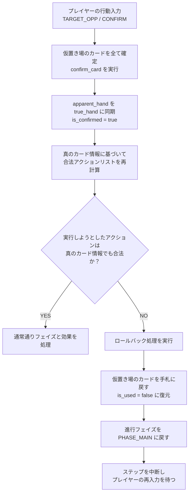

# 夢状態（Dream Curse）の仕様および設計書

本ドキュメントでは、ゴッドフィールドの特殊ギミックである「夢状態（Dream Curse）」のゲーム仕様、C++コアエンジンにおけるPOMDP状態表現、全19種類の夢グループ分類、およびカード確定時のロールバック（セーフガード）処理の詳細について解説します。

---

## 1. 夢状態の基本仕様
プレイヤーが「夢」の状態異常にかかっているとき、手札の真の姿が隠され、同じ「夢グループ（DreamGroup）」に属する別のカード（偽の姿）に見えるようになります。

- **ドロー時の挙動:**
  - プレイヤーがカードを山札から引く際、そのプレイヤーが夢状態であれば、引いたカードは未確定状態（`is_confirmed = false`）になります。
  - 見た目（`apparent_hand`）は **50%** の確率でそのまま真のカードになり、残る **50%** で同じ夢グループの**自分以外**のカードから等確率に選ばれた偽の姿になります（確率は `constants.h` の `DREAM_DISGUISE_RATE`）。
  - つまり「見た目が真のカードと一致していること」は夢がかかっていない証拠にはなりません。夢の影響下にあるかどうかは `is_confirmed` でのみ判定できます。この非対称性が夢の情報隠蔽の要であり、`apparent_hand != true_hand` を不変条件として扱ってはいけません。
  - 奇跡カード、取引カード、および一部の特殊な神器（スーパーミラー等）は夢の影響を受けず、ドローした瞬間に即座に確定します。
- **使用確定時の挙動:**
  - 見た目のカードを使用して仮置き場（`staged_cards`）にカードを置いている時点では、カードの真の姿は明かされません（`is_confirmed = false` のまま）。
  - プレイヤーがターゲット（自分または相手）を選択するか、「確定（`CONFIRM`）」を実行した時点で、仮置きされているカードの真の姿が明かされます（`confirm_card` が走り、`is_confirmed = true` となり、見た目のカード情報が真のカード情報と同期します）。
- **取引時の挙動:**
  - 相手が「買う（Buy）」を使用して対象に選んだカードは、その取引が成立（YES）したか拒絶（NO）されたかにかかわらず、選択された時点で即座に真の姿が確定（`is_confirmed = true`）します。
- **磁気嵐（Magnetic Storm）発生時の挙動:**
  - 磁気嵐の効果によってお互いの手札が回収・シャッフルされ再分配される際、**どちらか一方のプレイヤーでも夢状態（CURSE_DREAM）である場合**、再分配されるすべての非確定カード（夢グループが `NONE` 以外）は未確定状態（`is_confirmed = false`）としてマスクされ、それぞれのプレイヤーの画面上に配り直されます。見た目が偽装されるかどうかは1枚ごとにドロー時と同じ50%判定を行うため、真の姿のまま見えるカードが混ざります。
- **治療・解除時の挙動:**
  - プレイヤーの夢状態が治療または解除される際（「ハートの貝がら」、「＜歌声＞」、または水星神の「さざ波の音」などの効果で `clear_all_status_effects` が呼び出された場合）、`CURSE_TYPE_DREAM` フラグが `false` にリセットされると同時に、手札内のすべての非空スロットについて `is_confirmed = true` に設定されます。
  - これと同期して、見た目の手札 `apparent_hand` が真の手札 `true_hand` に戻り、手札の視認性が即座かつ完全に復元されます。

---

## 2. 夢グループ（DreamGroup）分類
夢によって偽装されるグループは、**使用タイミングおよび特定の性能・属性が一致する神器同士**で完全に分離されています。これにより、「祈るが使えそうなのに実際は使えない」といった不整合は絶対に発生しません。

### ① 雑貨（2グループ）
- **通常雑貨（15種）:** メインフェイズで使用可能な雑貨（ timing = `main_sundry_phase` ）。
- **受動系雑貨（2種）:** 使用タイミングを持たない常時発動またはパッシブな雑貨（ timing = なし。例：太陽のお守り、月のお守り ）。

### ② 防具（9グループ）
- **無属性防具（18種）:** タイミングが `atk_defence_phase`、属性が `ELEM_NONE` または `ELEM_DARKNESS` の防具（指輪3種および冥王の指輪を含む）。
- **火属性防具（10種）:** タイミングが `atk_defence_phase`、属性が `ELEM_FIRE` の防具（指輪1種含む）。
- **水属性防具（9種）:** タイミングが `atk_defence_phase`、属性が `ELEM_WATER` の防具（指輪1種含む）。
- **木属性防具（10種）:** タイミングが `atk_defence_phase`、属性が `ELEM_WOOD` の防具（指輪1種含む。※はがねの盾は仕様上木属性です）。
- **土属性防具（9種）:** タイミングが `atk_defence_phase`、属性が `ELEM_STONE` の防具（指輪1種含む）。
- **光属性防具（3種）:** タイミングが `atk_defence_phase`、属性が `ELEM_LIGHT` の防具（指輪1種含む）。
- **奇跡対策防具（10種）:** タイミングが `miracle_defence_phase` の防具。
- **精霊系防具（3種）:** タイミングが `miracle_plus_phase` でかつ消費MPを0にする防具（精霊のぬいぐるみ等）。
- **＋攻撃防具（4種）:** タイミングが `atk_plus_phase` の防具（スパイクの盾等）。

### ③ 武器（7グループ）
- **通常武器（54種）:** タイミングが `main_atk_phase`、全体攻撃フラグが `false`、かつ反応タイプが `none` の武器。
- **全体攻撃武器（17種）:** `is_group_attack = true` の武器。
- **プラス武器（19種）:** タイミングが `atk_plus_phase` の武器。
- **奇跡対策武器（4種）:** タイミングが `miracle_defence_phase`、かつプラス攻撃の属性を持たない武器（月光のオノなど）。
- **奇跡対策プラス武器（2種）:** タイミングが `miracle_defence_phase` かつ `atk_plus_phase` の武器（スカイハープーン, エンゼルの弓）。
- **攻守兼用武器（6種）:** タイミングが `atk_defence_phase` かつ `main_atk_phase` のうち、反射能力を持たない武器（セイバーロッドなど）。
- **無属性反射武器（2種）:** 反射能力を持つ攻守兼用武器（反射剣、乱弾武剣）。

### ④ 常に確定（夢の影響を受けず即確定、`DreamGroup::NONE`）
- 奇跡カード（全種）
- 取引カード（両替、売る、買う）
- 守護神の行動（火星神、水星神などの全守護神行動・仮想カード）
- 悪魔系雑貨5種（小悪魔、中悪魔、大悪魔、イタズラマン、めぐみの妖精）
- 精霊の杖（精霊系武器1種）
- 魔神の木馬（全体攻撃防具兼用1種）
- ほむら巻き（攻守兼用武器属性付き1種）
- スーパーミラー、虹のカーテン、精霊のぬいぐるみ、ちからの粉

---

## 3. C++コアエンジンにおけるPOMDP状態表現
部分観測マルコフ決定過程（POMDP）として強化学習エージェントが観測する手札情報を隠蔽するため、C++側の `InternalState` 構造体に以下のメンバ変数を定義しています。

```cpp
struct alignas(64) InternalState {
    // ... 他のゲーム状態 ...
    int true_hand[2][18];        // プレイヤーの「真の手札」のカードID
    int apparent_hand[2][18];    // プレイヤーに見えている「見た目の手札」のカードID
    bool is_confirmed[2][18];    // カードIDの真偽が確定しているかどうかのフラグ
};
```

### O(1) 夢グループ判定設計
実行パフォーマンスを最適化するため、`CardFeatures` 構造体に `dream_group` メンバを設け、カードデータベース読み込み時（`init_game_logic`）に一度だけグループ分類を計算してキャッシュさせています。

```cpp
struct alignas(64) CardFeatures {
    // ... カード性能パラメータ ...
    DreamGroup dream_group;      // 事前計算された夢グループ列挙体キャッシュ
};
```
これにより、ゲーム中のドロー処理等で行われる夢の偽装カード抽選において、オーバーヘッドなしで高速に処理が行われます。

---

## 4. ロールバック（セーフガード）処理の仕組み
「夢グループ」の仕様が正しく機能している限り、通常プレイ中に「見た目ベースで合法だったアクションが、確定した後に非合法になる」ということは発生しません。しかし、エンジン側のバグや定義ミスによるクラッシュを防ぎ、堅牢性を保つ防衛策（セーフガード）として、以下のロールバック処理が `step_game`（[game_logic.cpp](../godfield_core/src/game_logic.cpp)）に実装されています。

### ロールバックの流れ



### コード実装例
```cpp
// 確定処理と合法性再検証
if ((current_action == ACTION_TARGET_SELF || 
     current_action == ACTION_TARGET_OPP || 
     current_action == ACTION_CONFIRM) && 
    state.num_staged_cards[me] > 0) {
    
    // 1. 仮置きされているカードをすべて真の姿へ確定させる
    for (int i = 0; i < state.num_staged_cards[me]; ++i) {
        confirm_card(state, me, state.staged_cards[me][i]);
    }
    
    // 2. 確定後の真の手札情報を用いて、合法手を再計算
    bool true_legal_actions[ACTION_SPACE_SIZE];
    get_legal_actions(state, true_legal_actions);
    
    // 3. 入力されたアクションが非合法と判定された場合（例外ケース）
    if (!true_legal_actions[current_action]) {
        // ロールバック：仮置き状態を解除して手札へ戻す（確定状態は維持）
        for (int i = 0; i < state.num_staged_cards[me]; ++i) {
            int slot = state.staged_cards[me][i];
            state.is_used[me][slot] = false;
        }
        state.num_staged_cards[me] = 0;
        
        // 進行フェイズを元のメインフェイズに巻き戻す
        if (state.current_phase == GamePhase::PHASE_MAIN_TARGET_SELECT ||
            state.current_phase == GamePhase::PHASE_ATTACK_PLUS ||
            state.current_phase == GamePhase::PHASE_GROUP_WEAPON ||
            state.current_phase == GamePhase::PHASE_GROUP_MIRACLE_PLUS ||
            state.current_phase == GamePhase::PHASE_MIRACLE_PLUS) {
            state.current_phase = GamePhase::PHASE_MAIN;
        }
        break; // 以降の通常処理をスキップしてブレイク
    }
}
```
この二重の安全弁により、ゲームルール定義データ（YAML）の調整中やカスタムルール追加時においても、ゲームエンジンの不整合を絶対に発生させない堅牢性が保たれています。
