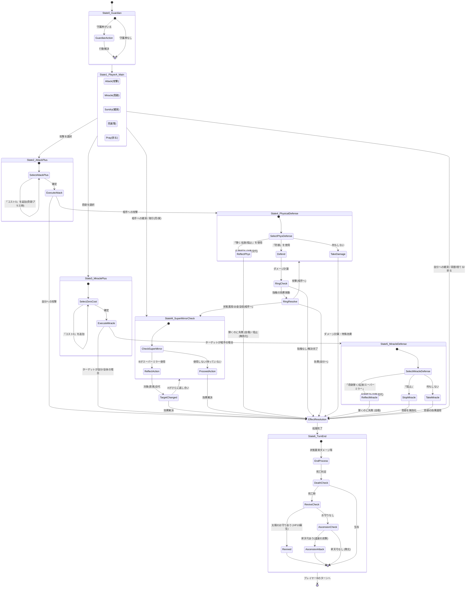

# GodField ゲーム状態遷移フローとカード仕様

このドキュメントでは、GodFieldのゲームにおけるプレイヤーAのターン開始から、次に相手プレイヤーBにターンが渡るまでのあらゆる状態遷移を定義し、フローチャートとして整理します。

## 1. カードの仕様

全てのカードは以下の基本属性と、使用タイミングを規定するフラグを持っています。

### 基本属性
- **名前 (Name)**
- **説明 (Description)**
- **値段 (Price)**

### 使用タイミングフラグ (Timing Flags)
※1つのカードが複数のフラグを併せ持つことがあります（例：「奇跡」でありつつ「攻撃のプラスに使える」など）。

1. **攻撃に使える (Attack)**: メインフェイズで攻撃の始点として使用可能。
2. **攻撃のプラスに使える (Attack Plus)**: 攻撃カードと組み合わせて攻撃力を加算するために使用可能。
3. **防御に使える (Defense)**: 相手からの攻撃に対する防御フェイズで使用可能。複数枚同時に使用して防御力を合算できる。相手の攻撃が属性攻撃の場合、対応する属性の防具しか使えないが、虹のカーテンを使うと無属性攻撃として防御できる。
4. **奇跡 (Miracle)**: メインフェイズで奇跡として使用可能（通常MPを消費）。
5. **奇跡のコストを0にするのに使える (Zero Cost Miracle)**: 奇跡を使用する際、同時に使用することでMP消費を0にする。
6. **雑貨として使用可能 (Sundry)**: メインフェイズで単発のアイテムとして使用可能。雑貨だが受動的にしか効果を発動しないものや、雑貨だが攻撃のプラスにしか使えないものなどもある。
7. **無属性攻撃の弾く/反射/阻止に使える (Attack Bounce/Reflect/Block)**: 相手からの攻撃に対する防御フェイズで使用する。「弾く(Bounce)」は50%の確率で相手に反射し、50%の確率で自傷(そのままダメージを受ける)する。「反射(Reflect)」は100%相手に跳ね返す。「阻止(Block)」は攻撃を無効化する。
8. **奇跡の弾く/反射/阻止に使える (Miracle Bounce/Reflect/Block)**: 相手からの奇跡に対するフェイズで使用する。「弾く(Bounce)」は50%の確率で相手に反射し、50%の確率で自傷する。「反射(Reflect)」は100%相手に跳ね返す。「阻止(Block)」は奇跡の効果を無くす。
9. **スーパーミラー (Super Mirror)**: あらゆるタイミングで使用可能で、取引などを含むあらゆる攻撃を反射する強力なカウンターアイテム。

---

## 2. 状態遷移フロー (テキスト記述)

プレイヤーAのターン開始からプレイヤーBにターンが移行するまでの流れを定義します。

### [State 0] プレイヤーA: 守護神フェイズ
プレイヤーAに守護神がいる場合、ランダムな行動を抽選し、実行します。行動終了後、[State 1]へ遷移します。

### [State 1] プレイヤーA: メインフェイズ
プレイヤーAは以下のいずれかのアクションを選択します。

- **A. 攻撃 (Attack)**: 「攻撃に使える」カードを選択。 -> [State 2]へ
- **B. 奇跡 (Miracle)**: 「奇跡」カードを選択。 -> [State 3]へ
- **C. 雑貨 (Sundry)**: 「雑貨として使用可能」カードを選択。相手を対象とする場合は [State M] へ。自分を対象とする場合は即座に効果を解決し、[State 6] へ。
- **D. 取引 (Deal)**: 「売る」「買う」「両替」「捨てる」を行う。「捨てる」「両替」は [State 6] へ。「売る」「買う」は [State M] へ。
- **E. 祈る (Pray)**: 手札に「攻撃に使える」カードが存在しない場合のみ選択可能。カードをランダムに1枚ドローする。 -> [State 6]へ

### [State 2] プレイヤーA: 攻撃追加フェイズ
- プレイヤーAは、「攻撃のプラスに使える」カードを追加で選択して攻撃力を高めることができます。
  - ※「攻撃プラス」として「奇跡」属性を持つカードを使用する場合、通常通りMPを消費しますが、これに対してさらに「奇跡のコストを0にする」カードを重ねて使用し、MP消費をなくすことも可能です。
- 確定すると、合計攻撃力・属性・特殊効果が決定され、攻撃が発動します。
  - 相手への攻撃の場合 -> [State 4] へ。
  - 自分への攻撃の場合 -> 即座に効果を解決し、[State 6] へ。

### [State 3] プレイヤーA: 奇跡追加フェイズ
- プレイヤーAは、「奇跡のコストを0にするのに使える」カードを追加で選択することができます。
- 確定すると奇跡が発動します。
  - ターゲットが相手の場合 -> [State 5]へ。
  - ターゲットが自分や全体の場合 -> 即座に効果を解決し、[State 6]へ。

### [State M] 取引・雑貨へのスーパーミラー割り込み判定
相手への雑貨の使用や、取引（売る/買うなど）のアクションが発生した際、Bが「スーパーミラー」を持っている場合は使用を選択できます。
- **スーパーミラーを使用**: アクションが反射され、対象や恩恵がプレイヤーAからプレイヤーBに移ります（Aがさらにスーパーミラーで返し合うことも可能です）。その後、効果が解決されます。
- **使用しない/持っていない**: アクションが進行し、そのまま効果が解決されます。

### [State 4] プレイヤーB: 攻撃防御フェイズ
プレイヤーBは迫りくる攻撃に対してリアクションを行います。
- **A. 防御 (Defense)**: 「防御に使える」カードを選択。ダメージを軽減（または無効化）します。防御カードに指輪を使った場合、その指輪の効果を解決します (複数ある場合は順番に)。
  - 指輪の効果が自分への場合: 即座に効果解決。 -> [State 6] へ
  - 指輪の効果が相手への状態異常付与/お金の没収の場合 -> [State M] へ
  - 指輪の効果が相手への攻撃の場合 -> [State 4] へ
- **B. 弾く/反射/阻止 (Bounce/Reflect/Block)**: 「無属性攻撃の弾く/反射/阻止に使える」カードを選択。「反射(Reflect)」は相手に跳ね返します。「弾く(Bounce)」は50%で相手に反射し、50%で自傷します。「阻止(Block)」は攻撃の効果を無くす。（相手に反射された場合、対象が交代し、[State 4]と同等の防御フェイズに移行します）
- **C. そのまま受ける (Take Hit)**: 何もせずにダメージと特殊効果を受け入れます。
- ※ダメージ処理と特殊効果の解決が行われます。 -> [State 6]へ

### [State 5] プレイヤーB: 奇跡防御フェイズ
プレイヤーBは迫りくる奇跡に対してリアクションを行います。
- **A. 奇跡を弾く/反射/阻止 (Miracle Bounce/Reflect/Block)**: 「奇跡の弾く/反射/阻止に使える」または「スーパーミラー」「阻止」を選択。
  - 「反射(Reflect)」は相手に跳ね返します。
  - 「弾く(Bounce)」は50%で相手に反射し、50%で自傷します。（相手に反射された場合、対象が交代し、[State 5]と同等の防御フェイズに移行します）
  - 「阻止(Block)」は奇跡の効果を打ち消します。
- **B. そのまま受ける (Take Effect)**: 奇跡の効果を受け入れます。
- ※奇跡の効果処理が解決されます。 -> [State 6]へ

### [State 6] ターン終了 (Turn End)
- 状態異常の継続ダメージなどの終了時処理を行います。
- このタイミングで死亡判定が発生した場合：
  - **太陽のお守りを持っている**: HP10で蘇生します。
  - **太陽のお守りがないが昇天弓を持っている**: 昇天弓による引き分け（道連れ）判定が開始されます。内部的にはターンが渡った後、昇天弓の回数だけ相手に昇天弓で追撃します。
  - 両方ともない場合は敗北となります。
- プレイヤーBにターンが渡ります。（次ターン開始）

---

## 3. フローチャート (Mermaid)

